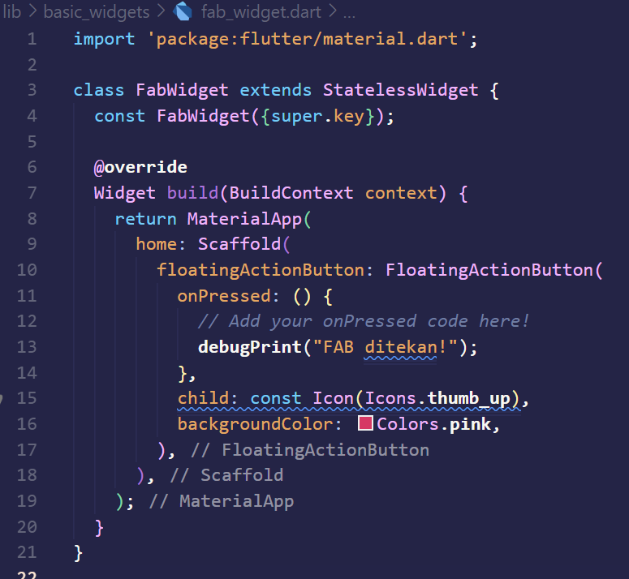
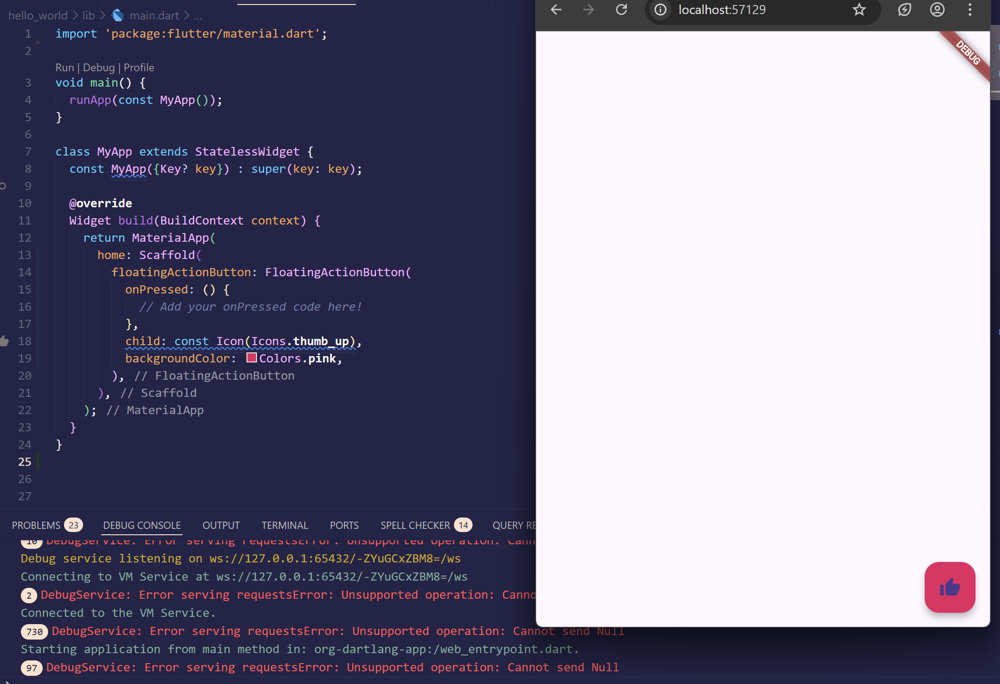

# Laporan Praktikum Pemrograman Mobile

## Aplikasi Pertama dan Widget Dasar Flutter

**Nama  :** Khoir Karol Nurzuraidah  
**NIM   :** 2341760048  
**Kelas :** SIB 3C  

---

## Langkah Praktikum

### Praktikum 1: Membuat Project Flutter Baru
- **Langkah 1:**  
  Buka Visual Studio Code (VS Code), tekan **Ctrl + Shift + P** → pilih **Flutter: New Application Project** untuk membuat proyek baru.  
  

  

- **Langkah 2:**  
  Pilih folder penyimpanan proyek (disarankan di *Documents* atau *Desktop*). Setelah itu, pilih **Select a folder to create the project in** untuk menentukan lokasi penyimpanan proyek.  

- **Langkah 3:**  
  Beri nama proyek `hello_world`, lalu tekan Enter.  
  

  

- **Langkah 4:**  
  Akan muncul pesan **"Your Flutter Project is ready!"** yang menandakan proyek berhasil dibuat.  
  

  

---

### Praktikum 2: Menghubungkan Perangkat Android atau Emulator

#### Mengaktifkan proses debug USB
- **Langkah 1:**  
  Di perangkat Android: **Settings → About phone → ketuk Build number 7x** sampai muncul pesan *You are now a developer!*.  
  

  
  

  

- **Langkah 2:**  
  Masuk ke **Settings → System → Developer options → aktifkan USB Debugging**.  
  

  
  

  
  

  

#### Android Studio
- **Langkah 3:**  
  Buka **Tools > SDK Manager > SDK Tools**, centang **Google USB Driver**, lalu klik OK.  
  

  
  

  

#### Menjalankan aplikasi di perangkat Android
- **Langkah 4:**  
  1. Sambungkan perangkat Android ke komputer menggunakan kabel USB. Akan muncul dialog untuk mengizinkan debug USB.  
  2. Centang **Always allow from this computer**, lalu klik **OK**.  
  3. Di Android Studio, pastikan perangkat Anda dipilih di dropdown device. Klik ikon **Run**.  
  

  
  

  

---

### Praktikum 3: Membuat Repository GitHub dan Laporan Praktikum
- **Langkah 1:**  
  Buat repository baru di GitHub dengan nama `flutter-fundamental-part1`.  
  

  

- **Langkah 2:**  
  Klik **Create repository**.  
  

  

- **Langkah 3:**  
  Buka project `hello_world` di VS Code → buka **Terminal > New Terminal**, lalu lakukan inisialisasi git.  
  

  

- **Langkah 4:**  
  Buka menu **Source Control** di sisi kiri VS Code, lalu lakukan **stage (+)** pada file `.gitignore`.  
  

  

- **Langkah 5:**  
  Commit dengan pesan **"tambah gitignore"**.  
  

  

- **Langkah 6:**  
  Lakukan push dengan klik menu titik tiga > **Push**.  
  

  

- **Langkah 7:**  
  Di pojok kanan bawah akan tampil opsi **Add Remote**. Klik tombol tersebut.  
  

  

- **Langkah 8:**  
  Salin tautan repository GitHub, lalu klik **Add remote**. Beri nama remote **origin**.  
  

  
  

  

- **Langkah 9:**  
  Ulangi proses stage dan commit pada file `README.md`. Setelah push, masukkan username GitHub dan token. Reload repo, maka hasil push akan terlihat.  
  

  
  

  
  

  

- **Langkah 10:**  
  Push semua file project dengan memilih **Stage All Changes**, lalu commit dengan pesan **"project hello_world"**.  
  

  
  

  

- **Langkah 11:**  
  Ubah platform di VS Code (pojok kanan bawah) ke emulator/device/Chrome. Jalankan project dengan **F5**.  
  

  

- **Langkah 12:**  
  Ubah teks aplikasi menjadi **nama lengkap**, jalankan ulang project, lalu screenshot hasilnya (`01.png`). Tambahkan ke README.md.  
  

  
  

  

---

### Praktikum 4: Menerapkan Widget Dasar

#### Langkah 1: Text Widget
- Buat folder `basic_widgets` di dalam folder `lib`, lalu buat file `text_widget.dart`.  
- Lakukan import ke `main.dart`, ganti Text bawaan dengan kode tersebut.  
- Jalankan aplikasi, screenshot hasil, lalu tambahkan ke README.md.  

  

  

#### Langkah 2: Image Widget
- Buat file `image_widget.dart` di dalam folder `basic_widgets`.  
- Tambahkan file logo ke folder `assets`, lalu sesuaikan kode & import ke `main.dart`.  
- Jalankan aplikasi, screenshot hasil, tambahkan ke README.md.  

  

---

### Praktikum 5: Menerapkan Widget Material Design dan iOS Cupertino

#### Langkah 1: Cupertino Button dan Loading Bar
- Buat file `loading_cupertino.dart` di folder `basic_widgets`.  
- Import `material.dart` dan `cupertino.dart`.  
- Tambahkan kode untuk `CupertinoButton` & `CupertinoActivityIndicator`.  

  

  

#### Langkah 2: Floating Action Button (FAB)
- Buat file `fab_widget.dart` di folder `basic_widgets`.  
- Tambahkan kode FAB dengan `StatelessWidget`.  

  

  

#### Langkah 3: Scaffold Widget
- Gunakan widget `Scaffold` untuk tata letak Material Design.  

  

  

#### Langkah 4: Dialog Widget
- Implementasikan `AlertDialog` dan `SimpleDialog` pada `main.dart`.  

  

  

#### Langkah 5: Input dan Selection Widget
- Gunakan widget input seperti `Checkbox`, `Radio Button`, `Slider`, `Switch`, `Date & Time Picker`, dan `TextField`.  

  

  

#### Langkah 6: Date and Time Pickers
- Tambahkan widget untuk memilih tanggal/waktu (DatePicker & TimePicker).  

  

  

  

---
